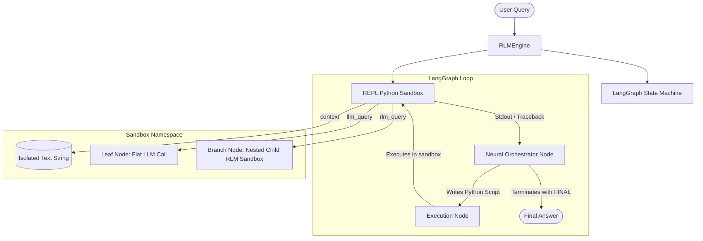

# Recursive Language Models (RLM) with LangGraph

This repository contains an implementation of **Recursive Language Models (RLMs)** based on MIT CSAIL research using **LangGraph**. 

Traditional LLM applications ingest long prompts directly into the model's neural context window, leading to token exhaustion, massive API bills, and "context rot". RLMs completely isolate the raw text inside a stateful Python sandbox environment. The orchestrator model only interacts with metadata, executing Python scripts to slice and aggregate context chunks programmatically. It scales compute at inference time by recursively invoking itself or cheaper sub-models (leaf nodes).

---

## Architecture Overview



### 1. Stateful REPL Environment (`rlm/sandbox.py`)
- Isolates raw text as `context` in a persistent Python namespace.
- Preserves variables and libraries across execution turns.
- Redirects and captures `stdout`/`stderr` output buffers and formats python tracebacks for error self-correction.
- Exposes `llm_query` and `rlm_query` helper interfaces in the sandbox namespace.

### 2. Neural Orchestrator (`rlm/graph.py` / `rlm/prompts.py`)
- Formulates code blocks in markdown (` ```python `) or yields final answers (`FINAL: <answer>`).
- Does not see the raw text of the document, only the character length and custom sandbox variable inventories.

### 3. Worker Sub-Routine Tree (`rlm/engine.py`)
- **Leaf Nodes (`llm_query`)**: Invokes a targeted, single-turn query using a cheaper/faster model (or simulation fallback) on a localized text slice.
- **Branch Nodes (`rlm_query`)**: Recursively spins up an entirely new, isolated child `RLMEngine` to solve complex queries on nested slices, maintaining an execution depth trace.

---

## File Structure

```
recursive-language-model/
├── requirements.txt      # Project library specifications
├── rlm/                  # Core RLM package
│   ├── __init__.py
│   ├── sandbox.py        # Python REPL sandbox & outputs capturer
│   ├── models.py         # Provider connectors & stateless Mock model
│   ├── prompts.py        # System instructions & turn formats
│   ├── graph.py          # LangGraph state nodes & routers
│   └── engine.py         # Compiled graph driver & recursive callbacks
├── tests/                # Test suite
│   ├── __init__.py
│   ├── test_sandbox.py   # Unit tests for sandbox behavior
│   └── test_rlm.py       # Integration tests for graph loops & recursion
├── main.py               # CLI runner and simulation demo
└── README.md             # Documentation
```

---

## Setup & Installation

Ensure you have Python 3.9+ installed on your system.

1. **Clone and Navigate to Project Directory:**
   ```bash
   cd recursive-language-model
   ```

2. **Initialize Virtual Environment & Install Dependencies:**
   ```bash
   python3 -m venv .venv
   source .venv/bin/activate
   pip install -r requirements.txt
   ```

3. **Configure Environment Variables (Optional):**
   Create a `.env` file in the root directory to run live LLM calls:
   ```ini
   # OpenAI API key (for provider: openai)
   OPENAI_API_KEY=your-openai-api-key
   
   # Anthropic API key (for provider: anthropic)
   ANTHROPIC_API_KEY=your-anthropic-api-key
   
   # Google GenAI API key (for provider: google)
   GEMINI_API_KEY=your-gemini-api-key
   ```

---

## Execution Guide

### 1. Run the Simulation Demo (Recommended)
If you do not have API keys configured, you can run the pre-configured simulation demo. This runs a multi-paragraph project budget extraction task showing nested execution branches:
```bash
python3 main.py
```
This logs real-time, depth-indented execution branches like:
```text
[Depth 0] Initializing Sandbox (Context Length: 335 characters)
[Depth 0] Running neural orchestrator execution loop...
[Depth 0] --- Branch Node Call (rlm_query) ---
[Depth 0] Sub-Query: Identify project name and budget in text
  [Depth 1] Initializing Sandbox (Context Length: 33 characters)
  [Depth 1] --- Leaf Node Call (llm_query) ---
  [Depth 1] Sub-Query: What is the project name?
  ...
```

### 2. Run with Live LLMs over Local Files
Once you configure API keys, you can query custom text files using a live model:
```bash
python3 main.py \
  --provider openai \
  --model gpt-4o-mini \
  --context-file path/to/your/document.txt \
  --query "Extract all financial tables and aggregate their net totals"
```

---

## Running the Test Suite

Run the automated unit and integration tests to verify graph flow, error self-correction, variable persistence, and recursive routing:
```bash
python3 -m unittest discover -s tests
```
